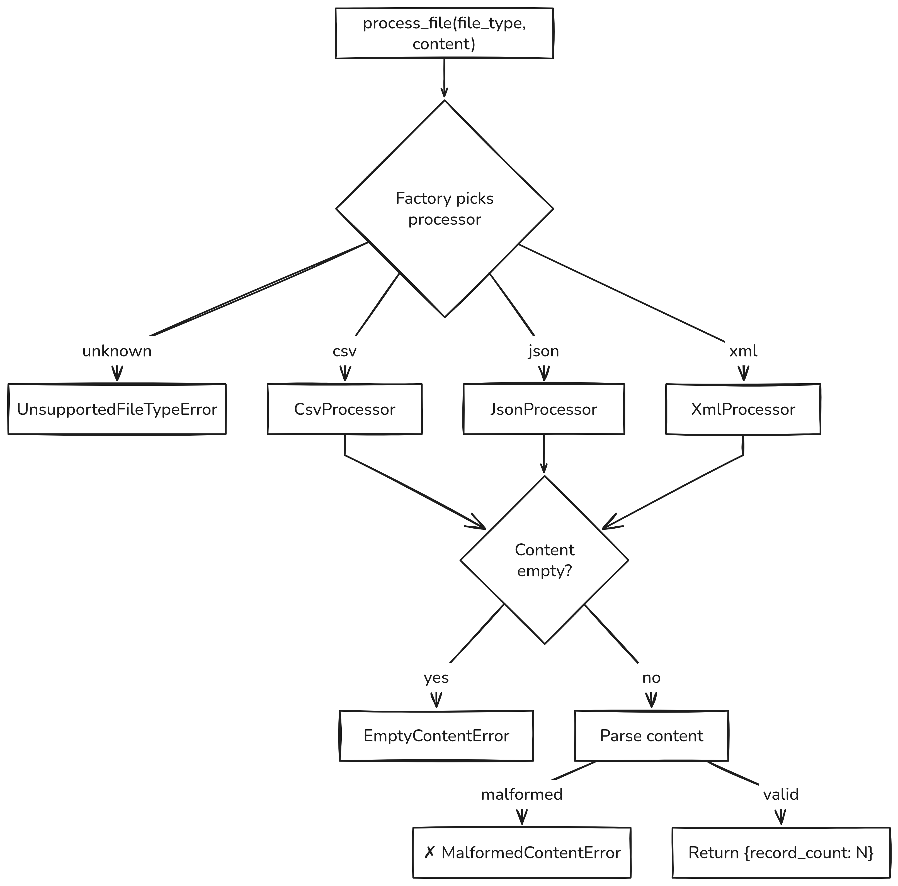

# File Processing Platform

Processes CSV, JSON, and XML files - validates content, parses it, and returns the record count.

## Setup

```bash
python3.13 -m venv .venv
source .venv/bin/activate
pip install -r requirements.txt
```

## Usage

```bash
python -m src.main <file_type> <file_path>

# Example
python -m src.main csv examples/sample.csv
```

## Running Tests

```bash
python -m pytest tests/
```

---

## Design Decisions

### Architecture

The system uses three collaborating pieces:

| Module | Role |
|---|---|
| `src/main.py` | Public `process_file()` function + CLI entry point |
| `src/factory/processor_factory.py` | Maps file type strings to processor instances |
| `src/processors/` | Strategy classes - one per file format |

Callers never touch processors directly - they go through the factory.

### Processor Strategies

| Processor | File Type | How It Counts |
|---|---|---|
| `CsvProcessor` | `.csv` | Splits lines, skips header, counts data rows |
| `JsonProcessor` | `.json` | `json.loads()`, returns `len()` of top-level array |
| `XmlProcessor` | `.xml` | `xml.etree.ElementTree`, counts root child elements |

All three inherit from `BaseProcessor` and implement `process(content)` which handles validation + parsing internally.

### Exception Handling

Custom exception hierarchy with manual error codes:

| Exception | Code | Example Message |
|---|---|---|
| `UnsupportedFileTypeError` | 1 | `"Unsupported file type: yaml"` |
| `MalformedContentError` | 2 | `"Invalid JSON"` |
| `EmptyContentError` | 3 | `"File content cannot be empty"` |

### Design Patterns

- **Strategy Pattern** - each file format is a separate processor class with a uniform `process()` interface, keeping format-specific logic isolated
- **Factory Pattern** - `ProcessorFactory.get_processor(type)` returns the right strategy instance, so callers don't care about which class to instantiate
- **Inheritance** - processors extend a `BaseProcessor` base that defines the common contract

### Test Coverage

21 tests across 2 files:

| File | Tests | What It Covers |
|---|---|---|
| `tests/test_processors.py` | 11 | Each processor - valid input, empty content, malformed content, edge cases (header-only, empty array, empty root) |
| `tests/test_factory.py` | 10 | Factory returns correct processor per type, case insensitivity, unknown types, integration via `process_file()` |

### Flow Diagram


